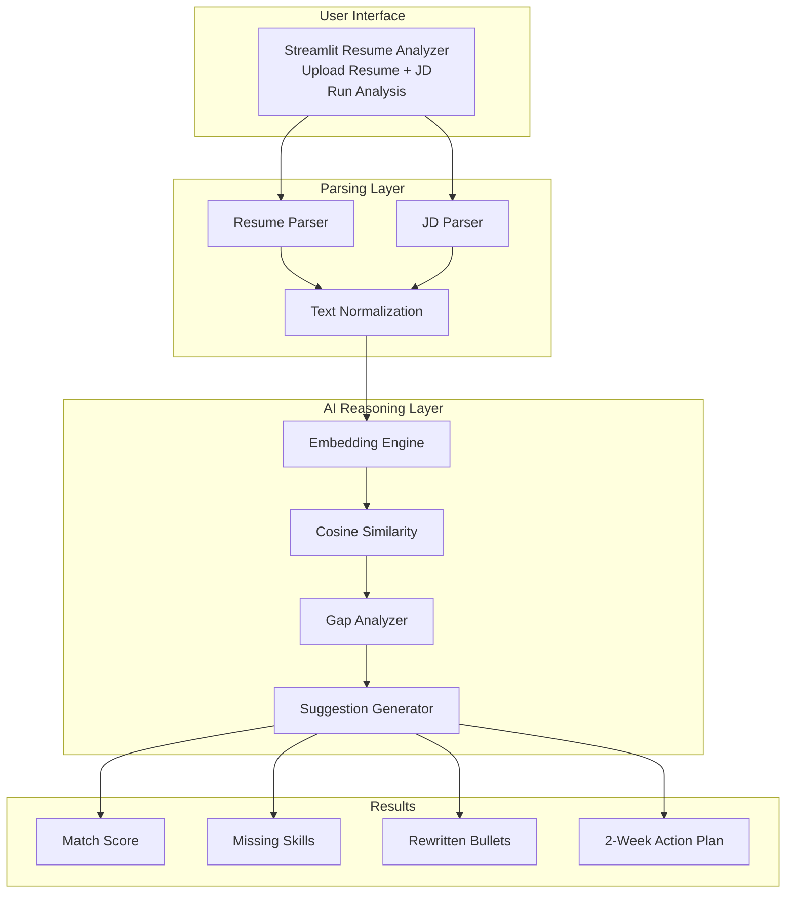
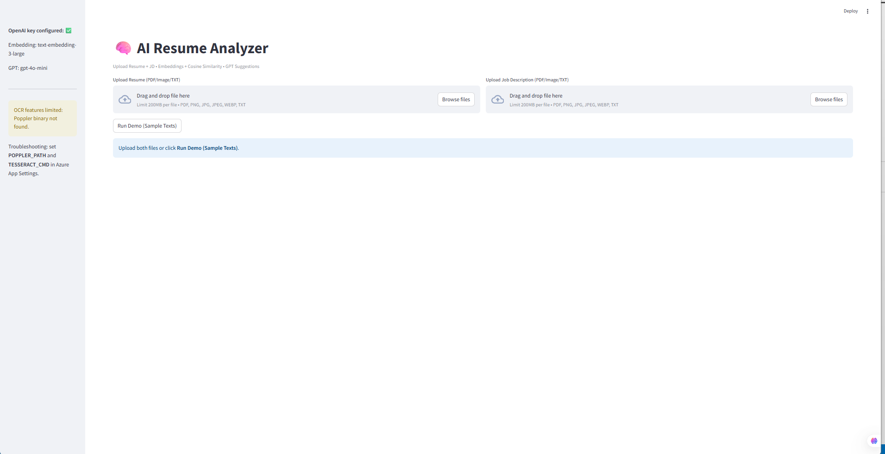
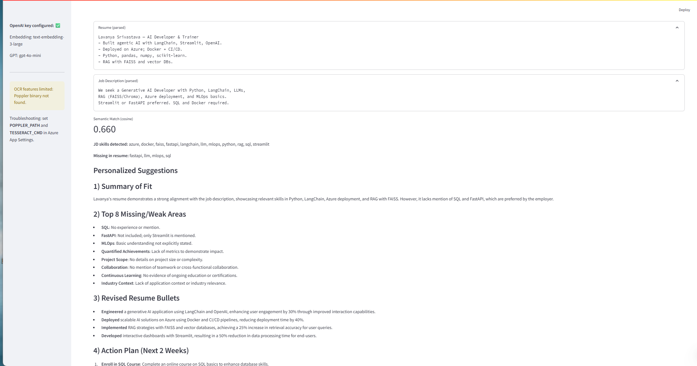

# AI Resume Analyzer — Intelligent Resume vs JD Matching


An AI-powered system that compares resumes with job descriptions and generates:

- 🎯 Semantic match score  
- ❌ Missing skills report  
- ✍ Rewritten resume bullets  
- 🚀 Actionable improvement plan  

> AI-assisted career coaching with explainable reasoning.

---

## Architecture



---

## Screenshots


<p align="center">
  
  
  
</p>

---

## Features

### Resume vs JD Parsing
- Upload resume
- Upload job description
- Extract structured text
- Normalize skills

### Semantic Matching
- Text → embeddings
- Cosine similarity scoring
- Missing skill detection

### GPT Reasoning
- Gap analysis
- Resume improvement suggestions
- Rewritten bullet points
- Career action roadmap

---

## Tech Stack

- Python
- Streamlit
- OpenAI Embeddings
- GPT-4o
- Pandas
- Cosine Similarity
- Prompt Engineering

---

## Quick Start

```bash
git clone https://github.com/lavanya1402/ai-resume-analyzer.git
cd ai-resume-analyzer

python -m venv venv
venv\Scripts\activate

pip install -r requirements.txt
streamlit run app.py
```

---

## Configuration

Create `.env` file:

```
OPENAI_API_KEY=your_api_key_here
```

---

## Project Structure

```
AI-Resume-Analyzer/
├── assets/
│   ├── First_Screenshot.png
│   ├── Second_Screenshot.png
│   ├── Third_Screenshot.png
│   └── architecture.mmd
├── src/
│   ├── resume_scorer.py
│   ├── resume_suggestions.py
│   ├── embedding_model.py
│   └── directory_reader.py
├── app.py
├── requirements.txt
├── README.md
```

---

## This project demonstrates

- AI resume intelligence  
- Semantic similarity matching  
- GPT reasoning workflows  
- Explainable decision output  
- Career guidance automation  

This is not just scoring.  
This is **AI-assisted career coaching**.

---

## License

MIT
