# ✅ README section with Mermaid + visible architecture

Paste this in your README:

````markdown
## Architecture Diagram

The system is built as a layered AI decision pipeline:

```mermaid
graph TB

%% ================= EXPERIENCE =================
subgraph E["🧑‍💼 Experience Layer (Single Workspace UI)"]
UI["🖥️ Resume Analyzer App<br/>
📤 Upload Resume + JD<br/>
▶️ Run Analysis<br/>
📊 View Fit Score<br/>
📝 Personalized Suggestions<br/>
⬇️ Download Report"]
end

%% ================= UNDERSTANDING =================
subgraph U["🧾 Understanding Layer (Parsing + Structuring)"]
U1["📄 Resume Parser<br/>Extract skills, roles, bullets"]
U2["📄 JD Parser<br/>Extract required skills"]
U3["🧠 Structured Profile Builder<br/>Normalize + clean text"]
end

%% ================= INTELLIGENCE =================
subgraph I["🧠 Intelligence Layer (Matching + Reasoning)"]
I1["🧬 Embedding Engine<br/>Text → Vector embeddings"]
I2["📐 Cosine Similarity Engine<br/>Fit score calculation"]
I3["🤖 LLM Gap Analyzer<br/>Weak areas detection"]
I4["✨ Suggestion Generator<br/>Resume improvements<br/>Action plan"]
end

%% ================= OUTPUT =================
subgraph O["📊 Output Layer (Decision Support)"]
O1["📈 Match Score Dashboard"]
O2["📋 Missing Skills Report"]
O3["📝 Revised Resume Bullets"]
O4["🚀 2-Week Action Plan"]
end

%% ================= DECISION ENGINE =================
subgraph D["🚀 Decision Engine"]
LLM["🤖 GPT Reasoning Engine<br/>Structured career advice"]
end

%% ================= FLOW =================
UI --> U1
UI --> U2
U1 --> U3
U2 --> U3
U3 --> I1
I1 --> I2
I2 --> I3
I3 --> I4
I4 --> O1
I4 --> O2
I4 --> O3
I4 --> O4
I4 --> LLM --> I4

%% ================= COLORS =================
classDef exp fill:#dbeafe,stroke:#1e40af,stroke-width:3px,color:#000;
classDef understand fill:#dcfce7,stroke:#166534,stroke-width:3px,color:#000;
classDef intel fill:#fef3c7,stroke:#92400e,stroke-width:3px,color:#000;
classDef output fill:#fce7f3,stroke:#9d174d,stroke-width:3px,color:#000;
classDef engine fill:#fff7ed,stroke:#c2410c,stroke-width:3px,color:#000;

class UI exp;
class U1,U2,U3 understand;
class I1,I2,I3,I4 intel;
class O1,O2,O3,O4 output;
class LLM engine;
```



---

## Architecture (SVG version)

If Mermaid preview is disabled on some GitHub clients:


````

---

# ✅ Screenshots block

```markdown
## Screenshots

| | |
|-|-|
|  |  |
|  |  |
|  |  |
```


Just tell me what you want next 😄

Best regards,
