# AI Resume Analyzer — Intelligent Resume vs JD Matching (Streamlit + GPT)


An **AI-powered resume analysis system** that compares a resume with a job description and generates:

- 🎯 semantic match score
- ❌ missing skills report
- ✍ revised resume bullets
- 🚀 actionable improvement plan

> Structured AI reasoning. Human decision remains in control.

---

## Architecture (Mermaid)

You can copy this Mermaid block anywhere:

```mermaid
graph TB

%% EXPERIENCE
subgraph Experience["🧑‍💼 Experience Layer (User Interface)"]
UI["Resume Analyzer App<br/>Upload Resume + JD<br/>Run Analysis<br/>View Score + Suggestions"]
end

%% UNDERSTANDING
subgraph Understanding["🧾 Understanding Layer"]
Parser1["Resume Parser"]
Parser2["JD Parser"]
Cleaner["Text Normalization"]
end

%% INTELLIGENCE
subgraph Intelligence["🧠 Intelligence Layer"]
Embed["Embedding Engine"]
Similarity["Cosine Similarity"]
Gap["Gap Analyzer"]
Suggest["Suggestion Generator"]
end

%% OUTPUT
subgraph Output["📊 Output Layer"]
Score["Match Score"]
Missing["Missing Skills"]
Bullets["Rewritten Bullets"]
Plan["2-Week Action Plan"]
end

UI --> Parser1
UI --> Parser2
Parser1 --> Cleaner
Parser2 --> Cleaner
Cleaner --> Embed
Embed --> Similarity
Similarity --> Gap
Gap --> Suggest
Suggest --> Score
Suggest --> Missing
Suggest --> Bullets
Suggest --> Plan
```



---

## Screenshots

| | |
|-|-|
|  |  |
|  |  |
|  |  |

> Replace images inside `/assets/`

---

## What It Does

### ✅ 1) Resume vs JD Parsing

- Upload resume
- Upload job description
- Extract structured text
- Normalize skills & content

### ✅ 2) Semantic Matching

- Convert text → embeddings
- Cosine similarity scoring
- Detect missing skills

### ✅ 3) GPT Reasoning

- Gap analysis
- Resume improvement suggestions
- Rewritten bullet points
- Career action plan

---

## Tech Stack

- Python
- Streamlit UI
- OpenAI Embeddings
- GPT-4o Reasoning
- Cosine Similarity
- Pandas
- Prompt Engineering

---

## Quick Start

```bash
git clone https://github.com/YOUR_REPO/ai-resume-analyzer.git
cd ai-resume-analyzer

python -m venv venv
venv\Scripts\activate

pip install -r requirements.txt
streamlit run app.py
```

---

## Configuration

Create `.env` file:

```
OPENAI_API_KEY=your_key_here
```

---

## Project Structure

```
AI-Resume-Analyzer/
├── assets/
│   ├── screenshot1.png
│   ├── screenshot2.png
│   └── architecture.mmd
├── src/
│   ├── resume_scorer.py
│   ├── resume_suggestions.py
│   ├── embedding_model.py
│   └── directory_reader.py
├── app.py
├── requirements.txt
├── README.md
```

---

## This project demonstrates

✅ AI resume intelligence  
✅ semantic similarity matching  
✅ GPT reasoning workflows  
✅ explainable decision output  
✅ career guidance automation

This is not just scoring.  
This is **AI-assisted career coaching**.

---

## License

MIT
